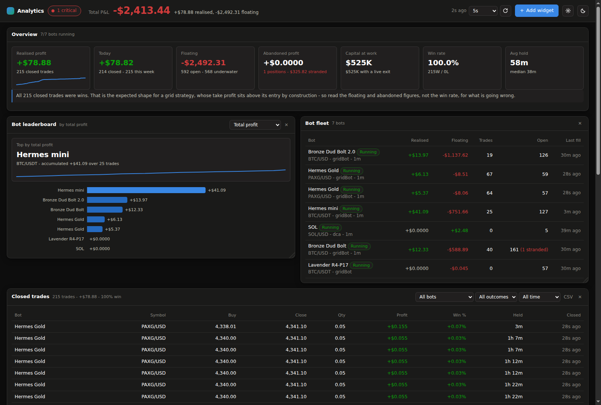
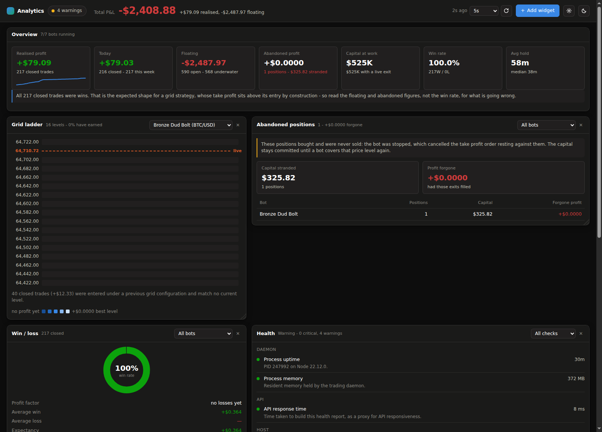

<p align="center">
  
</p>

<h1 align="center">OpenTrader MOH</h1>

<p align="center">
  An optimised fork of <a href="https://github.com/bludnic/opentrader">OpenTrader</a> that adds a real analytics
  dashboard, live health monitoring, an API for automation — and fixes three problems that were quietly
  costing the original money.
</p>

<p align="center">
  <a href="#the-dashboard">Dashboard</a> ·
  <a href="#health-monitoring">Health</a> ·
  <a href="#automation-api">Automation API</a> ·
  <a href="#what-was-fixed">Fixes</a> ·
  <a href="#getting-started">Getting started</a>
</p>

---

## Why this fork exists

Upstream OpenTrader lists your bots and whether they are running. It does not show profit anywhere, so you
cannot tell from the application whether the fleet is actually making money.

Reading the database directly told a different story than the UI did — and three findings shaped everything
in this fork:

**A win rate is meaningless for a grid bot.** Its take profit sits above its entry by construction, so every
closed trade is a win and the rate reads 100% forever. A dashboard leading with that number is worse than
useless: it is reassuring while the fleet bleeds. Profit here is reported through three separate lenses
instead — **realised**, **floating** and **abandoned** — and the UI says so in plain language wherever the
win rate would mislead.

**"Best bot" depends entirely on the metric.** Ranked by total profit the winner was one bot; by trade count
another; by profit per trade another again. So the leaderboard ranks by a metric *you* choose rather than
asserting one answer.

**Stopping a bot stranded every position it held.** That one turned out to be a genuine bug, and it had
orphaned hundreds of positions. See [what was fixed](#what-was-fixed).

---

## The dashboard

Served by OpenTrader itself at **`/analytics/`**, with an *Analytics* link added to the existing navigation.

19 widgets across five groups. Add them from a toolbar, drag to reorder, drag a corner to resize, and the
board is saved per browser. Everything refreshes on one batched request — twelve widgets on screen still cost
one round trip.

<p align="center">
  
</p>

| Group | Widgets |
|---|---|
| **Overview** | KPI strip · bot leaderboard · bot fleet |
| **Trades** | closed trades · open positions · abandoned positions · resting buy orders |
| **Grid & market** | grid ladder · grid coverage · market prices |
| **Analytics** | equity curve · win/loss · profit distribution · hold time · activity heatmap · fee impact |
| **Operations** | health · live events · bot logs |

A few that earn their place:

- **Grid ladder** — a vertical price ladder where every rung shows what it holds, what it is bidding for, what
  it has earned, and where the live price sits among them. Orders from a previous grid configuration are
  reported as off-grid rather than silently dropped from the totals.
- **Closed trades** — buy price, close price, quantity, profit in currency, profit %, hold time and time-ago,
  sortable and filterable, with CSV export.
- **Abandoned positions** — capital committed to positions with no order able to close them. This is the panel
  that found the bug below.

**Closed-deal toasts.** When a deal closes you get a notification with the direction, the amount and the
percent. Events are derived from order fill times rather than a server buffer, so nothing is missed across a
restart and nothing is replayed after a reload.

**Refresh** defaults to 5 s (1 s–60 s or paused), pauses while the tab is hidden, and holds the previous
render at reduced opacity while refetching rather than flashing a skeleton.

---

## Health monitoring

Fifteen checks across daemon, API, host, database, exchange, bots, orders and build integrity, rolled up to
OK / WARN / CRIT in the header.

The one worth calling out inspects **the running build** for the paper-exchange fill fix. That fix has
historically been applied by hand to a built bundle, where any rebuild silently reverts it — and without it no
limit order ever fills, so every other panel would quietly show a fleet that had simply stopped.

Two checks were corrected after their first live run, both false alarms, and both now have regression tests:

- *Orders awaiting placement* counted take profits waiting behind an unfilled entry — which is just how
  OpenTrader holds an exit until it is needed. It reported 17 stuck orders on a healthy install.
- *Market data freshness* conflated "we have stopped fetching" with "this pair trades quietly".

A check that cries wolf is worse than no check.

---

## Automation API

A plain JSON surface at `/api/dash/`, so driving OpenTrader from a script, a workflow tool or an AI agent is an
ordinary HTTP call. It shares its builders with the dashboard, so an agent can never read different numbers
from the ones on screen.

```http
GET  /api/dash/manifest                       self-describing catalogue of everything callable
GET  /api/dash/snapshot | health | trades | positions | grid | history | events | logs
GET  /api/dash/positions/stranded             read-only dry run of what recovery would place
POST /api/dash/actions/bot.start              {"botId": 5}
POST /api/dash/actions/bot.stop | bot.restart
POST /api/dash/actions/position.recoverStranded  {"limit": 25}
POST /api/dash/actions/freeze                 {"frozen": true}   (admin only)
```

Authenticate with the admin password, or give automation its own scoped token so it never holds it:

```bash
DASHBOARD_AGENT_TOKENS="research:tok_abc:read,trader:tok_def:control"
DASHBOARD_AGENT_CONTROL=off     # optional: disable all control at boot
```

A `read` token cannot act. Control is rate limited, can be frozen at runtime without a restart (and an agent
cannot unfreeze itself), and **every attempt — allowed, denied or failed — is recorded and surfaces in the
event feed and as a toast**, so you see it when an agent touches a bot.

---

## What was fixed

Three problems, each measured on a live install before and after.

### Bot logs were 99.9% of the database

`MarketData` carries the entire candle history a strategy was warmed with, and it was serialised into every
log entry. One DCA bot on a 1-minute timeframe wrote ~219 KB per minute; the other six bots together
accounted for 0.8 MB.

The history is not what a log entry is for. It is now summarised to the triggering candle plus a count and
time span, at the single chokepoint in `xprisma.botLog.log`, with a retention policy
(`BOT_LOG_RETENTION_DAYS`, default 30) pruned off the trading path.

| | Before | After |
|---|---|---|
| Log entry | 219 KB | **175 bytes** |
| Database | 734 MB | **1.1 MB** |
| Rows kept | 3,632 | 3,632 — none lost |

### Stopping a bot stranded every position it held

`cancelOrders()` cancelled *all* orders on a trade, including a take profit sitting against an entry that had
already filled. That does not reduce exposure — the asset is still owned — it only removes the way out. It
also cleared the trade's `ref`, and since a bot re-adopts its trades by ref, the orphaning was permanent: on
restart the bot could not find the position and simply opened a new one at the same level.

[`stop-policy.ts`](packages/bot/src/processing/executors/stop-policy.ts) makes the rule explicit and applies it
in the trade, DCA and arb executors:

| On stop | Behaviour |
|---|---|
| Entry that never filled | cancel — no position exists |
| Exit against a **held** position | **leave working** — it is the only way out |
| Trade still holding stock | **keep the ref**, so a restart re-adopts it |

A resting take profit can still fill while the bot is stopped, which is the point: the position closes at its
target instead of sitting indefinitely.

[`recover-position.ts`](packages/bot/src/processing/executors/recover-position.ts) repairs positions already
stranded by the old behaviour, re-placing an exit at the price the cancelled one carried through the
platform's own `OrderExecutor` rather than writing exchange state by hand. On the install this was built
against it recovered **561 positions with zero failures**.

### Every query was a full table scan

No index existed on any foreign key. Added on `Order(smartTradeId)`, `Order(status, entityType)`,
`SmartTrade(botId)`, `SmartTrade(ref)`, `BotLog(botId, createdAt)` and `BotLog(createdAt)`.

```
BotLog group by : SCAN BotLog       →  SCAN using COVERING INDEX
Order by trade  : SCAN Order        →  SEARCH using INDEX (smartTradeId=?)
Trade by bot    : SCAN SmartTrade   →  SEARCH using INDEX (botId=?)
```

Dashboard polls went from ~1 s to **0.25–0.36 s**.

> **Deploying to an existing database:** the schema is the source of truth, but an install created with
> `prisma db push` has no `_prisma_migrations` table, so `prisma migrate deploy` is *not* safe there — it will
> try to recreate existing tables. Apply the same indexes with `CREATE INDEX IF NOT EXISTS`, and consider
> `PRAGMA journal_mode=WAL` while you are there: rollback-journal mode serialises readers against the writer,
> which is what makes concurrent reads fail with *database is locked*.

---

## Getting started

Same as upstream — this fork changes no installation step.

```bash
pnpm install
pnpm build

# point at your database and set an admin password
export DATABASE_URL="file:/var/lib/opentrader/opentrader.db"
export ADMIN_PASSWORD="..."

node app/dist/daemon.mjs
```

Then open:

| | |
|---|---|
| Bot management (upstream UI) | `http://localhost:8000/` |
| **Analytics dashboard** | `http://localhost:8000/analytics/` |
| Automation API catalogue | `http://localhost:8000/api/dash/manifest` |

### Configuration

| Variable | Default | Purpose |
|---|---|---|
| `ADMIN_PASSWORD` | — | Authenticates the UI and the API |
| `BOT_LOG_RETENTION_DAYS` | `30` | Bot log retention; `0` disables pruning |
| `DASHBOARD_AGENT_TOKENS` | unset | `name:token:read\|control`, comma separated |
| `DASHBOARD_AGENT_CONTROL` | unset | `off` disables all agent control at boot |

---

## Development

```bash
pnpm test        # 298 tests
pnpm lint
pnpm build
```

The dashboard front end in [`app/dashboard-ui/`](app/dashboard-ui/) is deliberately plain ES modules and CSS —
no build step, no bundler, no external requests. Editing a widget and reloading is the whole loop.

The analytics themselves live in [`packages/trpc/src/services/analytics/`](packages/trpc/src/services/analytics/)
and are pure functions: they take plain rows and return plain data, with every database and exchange call left
to the handlers. That is what makes the P&L maths, the health thresholds and the event logic testable without
a running daemon.

Charts follow a validated colour palette — categorical slots that clear every all-pairs colourblind gate in
both light and dark modes, a single-hue ramp for magnitude, and reserved status colours. Profit and loss are
always accompanied by a sign or a word, so meaning never rests on hue alone.

---

## Credits

Built on [OpenTrader](https://github.com/bludnic/opentrader) by [bludnic](https://github.com/bludnic) — all
the trading engine, strategies and exchange integration are theirs. This fork adds the analytics layer and the
fixes described above. Upstream's own README is preserved as
[`README.upstream.md`](README.upstream.md).

Licensed under [Apache 2.0](LICENSE), same as upstream.
